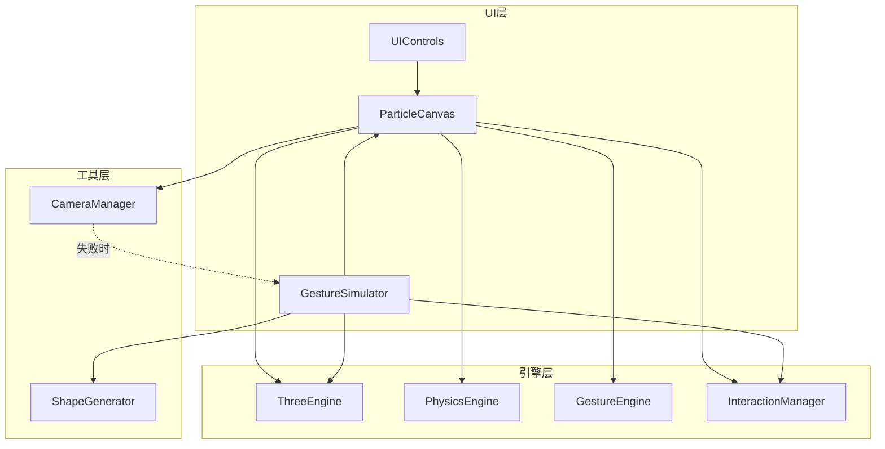
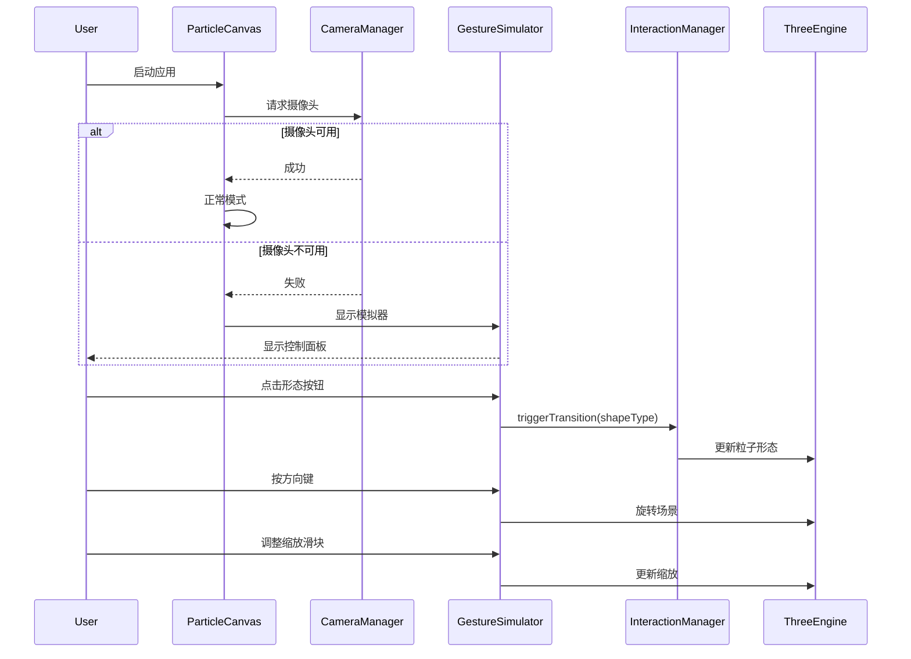

# 设计文档

## 概述

本设计文档描述了 WebAR 粒子交互系统的无摄像头降级处理和手势模拟器功能的技术实现方案。该功能允许用户在没有摄像头的情况下正常使用应用，并通过 UI 控件和键盘操作来模拟手势交互。

### 核心目标

1. **优雅降级**: 摄像头不可用时不阻塞应用启动，自动切换到模拟器模式
2. **完整体验**: 模拟器提供与真实手势相同的交互效果
3. **动态扩展**: 新增形态时模拟器自动适配，无需修改代码
4. **平滑过渡**: 所有交互效果都有平滑的动画过渡

## 架构

### 系统架构图



### 数据流



## 组件和接口

### 1. GestureSimulator 组件

新增的手势模拟器 React 组件，提供形态切换、旋转控制和缩放控制功能。

```typescript
// src/components/GestureSimulator.tsx

interface GestureSimulatorProps {
  visible: boolean;                          // 是否显示面板
  currentShape: ShapeType;                   // 当前形态
  onShapeChange: (shape: ShapeType) => void; // 形态变化回调
  onRotationChange: (rotation: Euler) => void; // 旋转变化回调
  onScaleChange: (scale: number) => void;    // 缩放变化回调
  onClose?: () => void;                      // 关闭面板回调
}

interface ShapeButtonConfig {
  type: ShapeType;
  label: string;
  icon: string;
  gesture: string;  // 对应的手势名称
}
```

### 2. ParticleCanvas 组件扩展

扩展现有的 ParticleCanvas 组件以支持降级模式。

```typescript
// 扩展 ParticleCanvasProps
interface ParticleCanvasProps {
  // ... 现有属性
  enableFallbackMode?: boolean;     // 是否启用降级模式，默认 true
  showSimulatorButton?: boolean;    // 是否显示模拟器按钮，默认 true
  onCameraStatusChange?: (available: boolean) => void; // 摄像头状态回调
}
```

### 3. ThreeEngine 扩展

扩展 ThreeEngine 以支持场景旋转和缩放控制。

```typescript
// 扩展 ThreeEngine 方法
interface ThreeEngineExtensions {
  setSceneRotation(rotation: Euler): void;   // 设置场景旋转
  addSceneRotation(delta: Euler): void;      // 增量旋转
  setSceneScale(scale: number): void;        // 设置场景缩放
  getSceneRotation(): Euler;                 // 获取当前旋转
  getSceneScale(): number;                   // 获取当前缩放
}
```

### 4. 形态配置映射

动态生成形态按钮的配置映射。

```typescript
// src/config/shapeConfig.ts

interface ShapeConfig {
  label: string;      // 中文标签
  icon: string;       // 图标 emoji
  gesture: string;    // 对应手势
  color?: string;     // 按钮颜色
}

// 从 ShapeType 枚举自动生成配置
const SHAPE_CONFIG_MAP: Record<ShapeType, ShapeConfig> = {
  [ShapeType.PLANET]: { label: '行星', icon: '🌍', gesture: '张手' },
  [ShapeType.TEXT]: { label: '文字', icon: '📝', gesture: '剪刀手' },
  [ShapeType.TORUS]: { label: '圆环', icon: '⭕', gesture: '握拳' },
  [ShapeType.STAR]: { label: '星形', icon: '⭐', gesture: '食指' },
  [ShapeType.HEART]: { label: '爱心', icon: '❤️', gesture: '竖大拇指' },
  [ShapeType.ARROW_HEART]: { label: '一箭穿心', icon: '💘', gesture: '手指比心' }
};

// 获取所有形态类型（用于动态生成按钮）
function getAllShapeTypes(): ShapeType[] {
  return Object.values(ShapeType);
}

// 获取形态配置（带默认值回退）
function getShapeConfig(type: ShapeType): ShapeConfig {
  return SHAPE_CONFIG_MAP[type] || {
    label: type,
    icon: '❓',
    gesture: '未知'
  };
}
```

## 数据模型

### 模拟器状态

```typescript
interface SimulatorState {
  isActive: boolean;           // 模拟器是否激活
  currentShape: ShapeType;     // 当前形态
  rotation: Euler;             // 当前旋转角度
  scale: number;               // 当前缩放比例
  pressedKeys: Set<string>;    // 当前按下的键
}

interface Euler {
  x: number;  // 绕 X 轴旋转（弧度）
  y: number;  // 绕 Y 轴旋转（弧度）
  z: number;  // 绕 Z 轴旋转（弧度）
}
```

### 摄像头状态

```typescript
interface CameraStatus {
  available: boolean;          // 摄像头是否可用
  error?: CameraErrorType;     // 错误类型
  errorMessage?: string;       // 错误消息
  canRetry: boolean;           // 是否可以重试
}
```

## 正确性属性

*A property is a characteristic or behavior that should hold true across all valid executions of a system-essentially, a formal statement about what the system should do. 
Properties serve as the bridge between human-readable specifications and machine-verifiable correctness guarantees.*


基于验收标准分析，以下属性经过冗余检查后保留：

### Property 1: 形态按钮数量与枚举值一致

*对于任意* ShapeType 枚举，手势模拟器生成的形态按钮数量应该等于枚举中的值数量。

**验证: 需求 2.1, 6.1**

### Property 2: 形态按钮点击触发正确的形态转换

*对于任意* 形态类型，点击对应的形态按钮后，系统应该触发该形态的转换，且当前形态状态应该更新为点击的形态。

**验证: 需求 2.3, 2.4**

### Property 3: 方向键旋转变换正确性

*对于任意* 方向键输入（上、下、左、右及其组合），旋转变换应该正确应用：
- 上键增加 X 轴旋转
- 下键减少 X 轴旋转
- 左键增加 Y 轴旋转
- 右键减少 Y 轴旋转
- 组合键同时应用多个旋转

**验证: 需求 3.1, 3.2, 3.3, 3.4, 3.5**

### Property 4: 缩放滑块值与缩放比例的映射

*对于任意* 滑块值（在有效范围内），缩放比例应该按比例映射，且缩放值应该被限制在最小和最大边界内。

**验证: 需求 4.2, 4.4**

### Property 5: 缩放过渡平滑性

*对于任意* 缩放值变化，中间帧的缩放值应该在起始值和目标值之间，实现平滑插值。

**验证: 需求 4.3**

### Property 6: 形态配置默认值回退

*对于任意* 形态类型，如果没有配置映射，系统应该使用枚举值作为默认标签，而不是抛出错误。

**验证: 需求 6.2, 6.3**

### Property 7: 手动控制优先级

*对于任意* 同时存在摄像头输入和手动控制输入的情况，手动控制应该覆盖摄像头检测的手势。

**验证: 需求 5.2**

## 错误处理

### 摄像头错误处理

```typescript
// 摄像头初始化失败时的处理流程
async function handleCameraInitialization(): Promise<void> {
  const result = await cameraManager.requestCamera();
  
  if (!result.success) {
    // 记录错误但不阻塞
    console.warn('摄像头初始化失败:', result.errorMessage);
    
    // 进入降级模式
    setFallbackMode(true);
    setShowSimulator(true);
    
    // 根据错误类型决定是否显示重试选项
    if (result.error !== 'device_not_found') {
      setCanRetryCamera(true);
    }
  }
}
```

### 键盘事件错误处理

```typescript
// 防止键盘事件在输入框中触发
function handleKeyDown(event: KeyboardEvent): void {
  // 如果焦点在输入元素上，不处理方向键
  if (event.target instanceof HTMLInputElement || 
      event.target instanceof HTMLTextAreaElement) {
    return;
  }
  
  // 处理方向键
  if (['ArrowUp', 'ArrowDown', 'ArrowLeft', 'ArrowRight'].includes(event.key)) {
    event.preventDefault();
    handleArrowKey(event.key);
  }
}
```

### 形态配置缺失处理

```typescript
// 获取形态配置，带默认值回退
function getShapeConfig(type: ShapeType): ShapeConfig {
  const config = SHAPE_CONFIG_MAP[type];
  
  if (!config) {
    console.warn(`形态类型 ${type} 没有配置，使用默认值`);
    return {
      label: type,
      icon: '❓',
      gesture: '未知'
    };
  }
  
  return config;
}
```

## 测试策略

### 单元测试

使用 Vitest 进行单元测试，覆盖以下场景：

1. **GestureSimulator 组件测试**
   - 形态按钮渲染测试
   - 点击事件处理测试
   - 键盘事件处理测试
   - 缩放滑块交互测试

2. **形态配置测试**
   - 配置映射完整性测试
   - 默认值回退测试

3. **ThreeEngine 扩展测试**
   - 旋转变换测试
   - 缩放变换测试

### 属性测试

使用 fast-check 进行属性测试，验证以下属性：

1. **Property 1**: 形态按钮数量一致性
   - 生成随机的形态类型子集，验证按钮数量匹配

2. **Property 2**: 形态转换正确性
   - 生成随机的形态类型，验证点击后状态正确

3. **Property 3**: 旋转变换正确性
   - 生成随机的方向键组合，验证旋转变换正确

4. **Property 4**: 缩放映射正确性
   - 生成随机的滑块值，验证缩放在有效范围内

5. **Property 5**: 缩放平滑性
   - 生成随机的起始和目标缩放值，验证中间值在范围内

6. **Property 6**: 配置默认值回退
   - 生成随机的形态类型字符串，验证不会抛出错误

7. **Property 7**: 手动控制优先级
   - 生成随机的摄像头和手动输入组合，验证手动控制优先

### 测试配置

```typescript
// vitest.config.ts 中的属性测试配置
export default defineConfig({
  test: {
    // 属性测试运行 100 次迭代
    fuzz: {
      iterations: 100
    }
  }
});
```

### 测试文件结构

```
src/
├── components/
│   ├── GestureSimulator.tsx
│   ├── GestureSimulator.test.tsx      # 单元测试
│   └── GestureSimulator.property.test.ts  # 属性测试
├── config/
│   ├── shapeConfig.ts
│   └── shapeConfig.test.ts
└── engines/
    └── ThreeEngine.rotation.test.ts   # 旋转扩展测试
```
