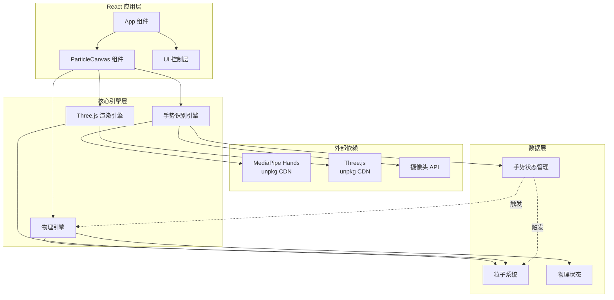
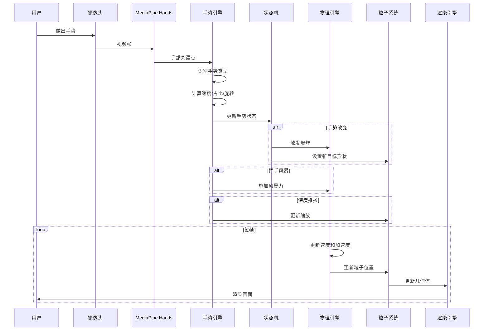
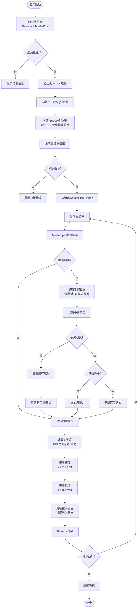

# 设计文档

## 概述

WebAR 粒子互动系统是一个基于 Web 技术的增强现实应用，通过摄像头实时捕捉用户手势，驱动 16,000 个粒子进行物理模拟和形态变换。系统采用 React 作为应用框架，Three.js 作为 3D 渲染引擎，MediaPipe Hands 作为手势识别引擎，所有外部依赖通过 unpkg CDN 加载以确保可用性。

核心设计理念是提供"极致丝滑"的交互体验，通过基于速度和加速度的物理模型（而非简单插值）实现自然流畅的粒子运动，并通过多种手势触发不同的粒子形态变换，配合爆炸过渡、挥手风暴、深度推拉等交互机制，创造沉浸式的 AR 体验。

## 架构

### 系统架构图



### 分层架构

1. **React 应用层**: 负责组件生命周期管理、状态管理和 UI 渲染
2. **核心引擎层**: 包含三个独立引擎，各司其职
3. **数据层**: 管理粒子数据、手势状态和物理状态
4. **外部依赖**: 通过 unpkg CDN 加载的第三方库和浏览器 API

## 组件和接口

### 1. React 组件结构

#### App 组件
```typescript
interface AppProps {}

interface AppState {
  isLoading: boolean;
  error: string | null;
  librariesLoaded: boolean;
}

// 职责：应用入口，管理全局状态和库加载
```

#### ParticleCanvas 组件
```typescript
interface ParticleCanvasProps {
  particleCount: number; // 默认 16000
  onGestureChange?: (gesture: GestureType) => void;
}

// 职责：Three.js 场景容器，协调三大引擎
```

### 2. 核心引擎接口

#### Three.js 渲染引擎
```typescript
interface ThreeEngine {
  scene: THREE.Scene;
  camera: THREE.PerspectiveCamera;
  renderer: THREE.WebGLRenderer;
  
  initialize(container: HTMLElement): void;
  render(): void;
  resize(width: number, height: number): void;
  dispose(): void;
}
```

#### 物理引擎
```typescript
interface Particle {
  position: THREE.Vector3;
  velocity: THREE.Vector3;
  acceleration: THREE.Vector3;
  targetPosition: THREE.Vector3;
  color: THREE.Color;
}

interface PhysicsEngine {
  particles: Particle[];
  
  initialize(count: number): void;
  update(deltaTime: number): void;
  applyForce(force: THREE.Vector3, radius: number, center: THREE.Vector3): void;
  setTargetShape(shape: ShapeType, params: ShapeParams): void;
  triggerExplosion(strength: number): void;
  applyDamping(factor: number): void;
}
```

#### 手势识别引擎
```typescript
enum GestureType {
  OPEN_HAND = 'open_hand',      // 张手 -> 行星
  SCISSORS = 'scissors',          // 剪刀手 -> 文字
  FIST = 'fist',                  // 握拳 -> 圆环
  POINT = 'point',                // 食指 -> 星形
  THUMBS_UP = 'thumbs_up',        // 竖大拇指 -> 爱心
  FINGER_HEART = 'finger_heart',  // 手指比心 -> 一箭穿心
  NONE = 'none'
}

interface HandData {
  landmarks: THREE.Vector3[];     // 21 个手部关键点
  center: THREE.Vector3;          // 手掌中心
  velocity: THREE.Vector3;        // 手部移动速度
  areaRatio: number;              // 手掌画面占比
  rotation: THREE.Euler;          // 手部旋转角度
}

interface GestureEngine {
  currentGesture: GestureType;
  handData: HandData | null;
  
  initialize(videoElement: HTMLVideoElement): Promise<void>;
  update(): Promise<void>;
  detectGesture(landmarks: any[]): GestureType;
  calculateHandVelocity(): THREE.Vector3;
  calculateAreaRatio(landmarks: any[]): number;
  calculateHandRotation(landmarks: any[]): THREE.Euler;
  dispose(): void;
}
```

### 3. 形状生成器接口

```typescript
enum ShapeType {
  PLANET = 'planet',
  TEXT = 'text',
  TORUS = 'torus',
  STAR = 'star',
  HEART = 'heart',
  ARROW_HEART = 'arrow_heart'
}

interface ShapeParams {
  radius?: number;
  text?: string;
  innerRadius?: number;
  outerRadius?: number;
  points?: number;
  scale?: number;
}

interface ShapeGenerator {
  generatePlanet(count: number, radius: number): THREE.Vector3[];
  generateText(text: string, count: number): THREE.Vector3[];
  generateTorus(count: number, innerRadius: number, outerRadius: number): THREE.Vector3[];
  generateStar(count: number, radius: number, points: number): THREE.Vector3[];
  generateHeart(count: number, scale: number): THREE.Vector3[];
  generateArrowHeart(count: number, scale: number): { 
    heart: THREE.Vector3[], 
    arrow: THREE.Vector3[] 
  };
}
```

### 4. 交互管理器接口

```typescript
interface InteractionManager {
  // 挥手风暴
  checkWaveStorm(velocity: THREE.Vector3): boolean;
  applyWaveForce(handCenter: THREE.Vector3, direction: THREE.Vector3): void;
  
  // 深度推拉
  updateScale(areaRatio: number): void;
  
  // 爆炸过渡
  triggerTransition(fromShape: ShapeType, toShape: ShapeType): void;
}
```

## 数据模型

### 粒子数据结构

```typescript
class ParticleData {
  // 位置相关
  position: Float32Array;        // [x, y, z] * 16000
  velocity: Float32Array;        // [vx, vy, vz] * 16000
  acceleration: Float32Array;    // [ax, ay, az] * 16000
  targetPosition: Float32Array;  // [tx, ty, tz] * 16000
  
  // 视觉相关
  color: Float32Array;           // [r, g, b] * 16000
  size: Float32Array;            // [size] * 16000
  
  // 物理参数
  mass: number = 1.0;
  damping: number = 0.95;
  maxSpeed: number = 10.0;
  
  // 方法
  updatePhysics(deltaTime: number): void;
  applyForce(force: THREE.Vector3, index: number): void;
  setTarget(target: THREE.Vector3, index: number): void;
}
```

### 手势状态机

```typescript
class GestureStateMachine {
  currentState: GestureType;
  previousState: GestureType;
  transitionTime: number;
  isTransitioning: boolean;
  
  transition(newState: GestureType): void {
    if (this.currentState !== newState) {
      this.previousState = this.currentState;
      this.currentState = newState;
      this.isTransitioning = true;
      this.transitionTime = 0;
    }
  }
  
  update(deltaTime: number): void {
    if (this.isTransitioning) {
      this.transitionTime += deltaTime;
      if (this.transitionTime > TRANSITION_DURATION) {
        this.isTransitioning = false;
      }
    }
  }
}
```

### 物理配置

```typescript
interface PhysicsConfig {
  // 基础物理参数
  gravity: THREE.Vector3;           // 重力（通常为 0）
  damping: number;                  // 阻尼系数 0.95
  maxSpeed: number;                 // 最大速度 10.0
  maxAcceleration: number;          // 最大加速度 5.0
  
  // 目标吸引力
  attractionStrength: number;       // 吸引力强度 2.0
  attractionRadius: number;         // 吸引力作用半径 0.5
  
  // 爆炸参数
  explosionStrength: number;        // 爆炸力强度 5.0
  explosionDuration: number;        // 爆炸持续时间 0.3s
  
  // 挥手风暴参数
  waveVelocityThreshold: number;    // 触发阈值 5.0
  waveForceStrength: number;        // 风暴力强度 8.0
  waveRadius: number;               // 影响半径 2.0
  
  // 深度推拉参数
  minScale: number;                 // 最小缩放 0.5
  maxScale: number;                 // 最大缩放 2.0
  scaleSmoothing: number;           // 缩放平滑系数 0.1
}
```

## 数据流图




## 正确性属性

*属性是指在系统所有有效执行过程中都应该保持为真的特征或行为——本质上是关于系统应该做什么的形式化陈述。属性是人类可读规范和机器可验证正确性保证之间的桥梁。*

### 属性反思

在编写具体属性之前，我们需要识别并消除冗余：

1. **粒子初始化相关**：属性 1（粒子数量）、属性 2（初始颜色）、属性 3（数据结构）可以合并为一个综合的初始化属性
2. **物理模拟相关**：属性 4（速度更新位置）、属性 5（加速度更新速度）、属性 6（力应用）是物理引擎的核心，应该保持独立
3. **形状生成相关**：每种形状的生成属性（属性 8-13）应该保持独立，因为它们测试不同的几何算法
4. **状态转换相关**：爆炸过渡的多个属性（属性 14-18）可以合并为一个综合属性
5. **交互相关**：挥手风暴（属性 19-23）和深度推拉（属性 24-28）的多个子属性可以各自合并

经过反思，我们将 50+ 个潜在属性精简为 20 个核心属性，每个都提供独特的验证价值。

### 核心属性

**属性 1: 粒子系统初始化完整性**
*对于任意*粒子系统初始化，系统应该创建恰好 16,000 个粒子，每个粒子都具有位置、速度、加速度属性，且初始颜色为青色
**验证需求: 1.2, 1.3, 1.4**

**属性 2: 速度积分更新位置**
*对于任意*粒子和时间步长 dt，新位置应该等于旧位置加上速度乘以 dt（position_new = position_old + velocity * dt）
**验证需求: 3.1**

**属性 3: 加速度积分更新速度**
*对于任意*粒子和时间步长 dt，新速度应该等于旧速度加上加速度乘以 dt（velocity_new = velocity_old + acceleration * dt）
**验证需求: 3.2**

**属性 4: 力正确应用为加速度**
*对于任意*粒子和施加的力向量，应用力后粒子的加速度应该按照 F = ma 正确更新
**验证需求: 3.3**

**属性 5: 阻尼减速效果**
*对于任意*接近目标位置的粒子，应用阻尼后速度大小应该减小
**验证需求: 3.5**

**属性 6: 行星形状生成**
*对于任意*粒子数量 n，生成的行星球体位置应该包含 n 个点，且所有点到球心的距离应该近似相等（在球体表面）
**验证需求: 4.1**

**属性 7: 行星金蓝渐变着色**
*对于任意*处于行星状态的粒子，其颜色应该在金色和蓝色之间渐变
**验证需求: 4.2**

**属性 8: 行星位置跟随手部**
*对于任意*手部中心位置，行星的中心应该移动到该位置
**验证需求: 4.3**

**属性 9: 行星旋转跟随手部**
*对于任意*手部旋转角度，行星应该应用相同的旋转变换
**验证需求: 4.4, 16.2, 16.3**

**属性 10: 文字形状粒子分配**
*对于任意*文字像素数据和粒子数量，所有粒子都应该被分配到文字形状的有效采样点上
**验证需求: 5.2**

**属性 11: 圆环形状几何约束**
*对于任意*生成的圆环位置，所有点到圆环中心轴的距离应该在内半径和外半径之间
**验证需求: 6.1, 6.3**

**属性 12: 圆环均匀分布**
*对于任意*生成的圆环，粒子应该在环面上均匀分布（通过统计方差验证）
**验证需求: 6.5**

**属性 13: 星形生成**
*对于任意*粒子数量，生成的五角星应该包含五个清晰的尖角区域
**验证需求: 7.1**

**属性 14: 心形区域填充**
*对于任意*生成的心形位置，所有点都应该在心形数学定义的区域内
**验证需求: 8.1, 8.5**

**属性 15: 比心粉色着色**
*对于任意*处于手指比心状态的粒子，其颜色应该变更为粉色
**验证需求: 9.1**

**属性 16: 状态转换触发爆炸**
*对于任意*手势状态变化，系统应该检测到状态切换并对所有粒子施加径向爆炸力
**验证需求: 10.1, 10.2, 10.3**

**属性 17: 爆炸后重组吸引**
*对于任意*达到最大扩散距离的粒子，系统应该施加指向新目标位置的吸引力
**验证需求: 10.5**

**属性 18: 手部速度计算**
*对于任意*手部位置历史序列，计算的速度应该等于位置变化除以时间间隔
**验证需求: 11.1**

**属性 19: 挥手风暴触发和力施加**
*对于任意*手部移动速度超过阈值的情况，系统应该识别为挥手风暴并对范围内粒子施加沿移动方向的力，力的强度随距离衰减
**验证需求: 11.2, 11.3, 11.4, 11.5**

**属性 20: 手掌占比与缩放正相关**
*对于任意*手掌画面占比变化，粒子系统的缩放比例应该相应增大或减小，且变化应该平滑过渡
**验证需求: 12.1, 12.2, 12.3, 12.4**

**属性 21: 缩放保持形状比例**
*对于任意*缩放操作，粒子形状的相对比例应该保持不变（等比缩放）
**验证需求: 12.5**

**属性 22: 手指状态分析**
*对于任意*有效的手部关键点数据，系统应该能够分析出每个手指的伸展状态（伸展或收起）
**验证需求: 13.1**

**属性 23: 手部旋转计算**
*对于任意*手部关键点，系统应该能够计算出手部的三维旋转角度和旋转轴
**验证需求: 16.1, 16.2**

**属性 24: 行星形状完整性**
*对于任意*旋转和倾斜变换，行星应该保持球体形状的完整性（所有点仍在球面上）
**验证需求: 16.5**

## 错误处理

### 库加载失败

```typescript
class LibraryLoader {
  async loadThreeJS(): Promise<void> {
    try {
      await this.loadScript('https://unpkg.com/three@0.150.0/build/three.min.js');
      if (typeof THREE === 'undefined') {
        throw new Error('Three.js 加载失败');
      }
    } catch (error) {
      this.handleLoadError('Three.js', error);
    }
  }
  
  async loadMediaPipe(): Promise<void> {
    try {
      await this.loadScript('https://unpkg.com/@mediapipe/hands@0.4.1646424915/hands.js');
      if (typeof Hands === 'undefined') {
        throw new Error('MediaPipe Hands 加载失败');
      }
    } catch (error) {
      this.handleLoadError('MediaPipe Hands', error);
    }
  }
  
  private handleLoadError(libraryName: string, error: Error): void {
    console.error(`${libraryName} 加载失败:`, error);
    // 显示用户友好的错误信息
    this.showErrorUI(`无法加载 ${libraryName}，请检查网络连接或刷新页面重试`);
  }
}
```

### 摄像头权限拒绝

```typescript
class CameraManager {
  async requestCamera(): Promise<MediaStream> {
    try {
      const stream = await navigator.mediaDevices.getUserMedia({ 
        video: { 
          width: 1280, 
          height: 720 
        } 
      });
      return stream;
    } catch (error) {
      if (error.name === 'NotAllowedError') {
        this.showErrorUI('需要摄像头权限才能使用手势交互功能');
      } else if (error.name === 'NotFoundError') {
        this.showErrorUI('未检测到摄像头设备');
      } else {
        this.showErrorUI('摄像头访问失败，请检查设备设置');
      }
      throw error;
    }
  }
}
```

### 手势识别失败

```typescript
class GestureEngine {
  detectGesture(landmarks: any[]): GestureType {
    try {
      if (!landmarks || landmarks.length !== 21) {
        console.warn('无效的手部关键点数据');
        return GestureType.NONE;
      }
      
      // 手势识别逻辑
      const fingerStates = this.analyzeFingerStates(landmarks);
      return this.classifyGesture(fingerStates);
      
    } catch (error) {
      console.error('手势识别错误:', error);
      return GestureType.NONE;
    }
  }
}
```

### 性能降级

```typescript
class PerformanceMonitor {
  private frameCount: number = 0;
  private lastTime: number = performance.now();
  private fps: number = 60;
  
  update(): void {
    this.frameCount++;
    const currentTime = performance.now();
    
    if (currentTime - this.lastTime >= 1000) {
      this.fps = this.frameCount;
      this.frameCount = 0;
      this.lastTime = currentTime;
      
      // 性能降级策略
      if (this.fps < 20) {
        this.applyPerformanceDegradation();
      }
    }
  }
  
  private applyPerformanceDegradation(): void {
    console.warn('性能不足，启动降级模式');
    // 减少粒子数量
    // 降低物理模拟精度
    // 减少手势检测频率
  }
}
```

### WebGL 上下文丢失

```typescript
class ThreeEngine {
  initialize(container: HTMLElement): void {
    this.renderer = new THREE.WebGLRenderer({ 
      antialias: true,
      powerPreference: 'high-performance'
    });
    
    // 监听上下文丢失
    this.renderer.domElement.addEventListener('webglcontextlost', (event) => {
      event.preventDefault();
      console.error('WebGL 上下文丢失');
      this.handleContextLost();
    });
    
    this.renderer.domElement.addEventListener('webglcontextrestored', () => {
      console.log('WebGL 上下文恢复');
      this.handleContextRestored();
    });
  }
  
  private handleContextLost(): void {
    cancelAnimationFrame(this.animationId);
    this.showErrorUI('图形渲染中断，正在尝试恢复...');
  }
  
  private handleContextRestored(): void {
    this.reinitializeScene();
    this.startRenderLoop();
  }
}
```

## 测试策略

### 双重测试方法

本项目采用单元测试和基于属性的测试相结合的方法，以确保全面的代码覆盖和正确性验证。

#### 单元测试

单元测试用于验证特定示例、边缘情况和错误条件：

- **形状生成器测试**: 验证特定参数下的形状生成（如 1000 个粒子的球体）
- **手势识别测试**: 验证特定手部关键点配置的手势分类
- **状态转换测试**: 验证特定状态切换序列的行为
- **错误处理测试**: 验证各种错误情况的处理逻辑
- **React 组件测试**: 验证组件挂载、卸载和生命周期

单元测试框架：**Vitest** + **React Testing Library**

#### 基于属性的测试

基于属性的测试用于验证应该在所有输入上保持的通用属性：

- **物理模拟属性**: 验证速度、加速度更新在任意粒子状态下的正确性
- **形状几何属性**: 验证生成的形状在任意参数下满足几何约束
- **交互属性**: 验证手势交互在任意手部数据下的响应
- **状态不变性**: 验证系统状态转换保持的不变量

基于属性的测试框架：**fast-check**

每个基于属性的测试应该：
- 运行至少 **100 次迭代**以确保充分覆盖
- 使用明确的注释标记对应的设计文档属性
- 标记格式：`// Feature: webar-particle-interaction, Property X: [属性描述]`

### 测试组织

```
src/
├── components/
│   ├── ParticleCanvas.tsx
│   └── ParticleCanvas.test.tsx          # 单元测试
├── engines/
│   ├── ThreeEngine.ts
│   ├── ThreeEngine.test.ts              # 单元测试
│   ├── PhysicsEngine.ts
│   ├── PhysicsEngine.test.ts            # 单元测试
│   ├── PhysicsEngine.property.test.ts   # 属性测试
│   ├── GestureEngine.ts
│   ├── GestureEngine.test.ts            # 单元测试
│   └── GestureEngine.property.test.ts   # 属性测试
├── shapes/
│   ├── ShapeGenerator.ts
│   ├── ShapeGenerator.test.ts           # 单元测试
│   └── ShapeGenerator.property.test.ts  # 属性测试
└── utils/
    ├── LibraryLoader.ts
    └── LibraryLoader.test.ts            # 单元测试
```

### 测试示例

#### 单元测试示例

```typescript
// PhysicsEngine.test.ts
import { describe, it, expect } from 'vitest';
import { PhysicsEngine } from './PhysicsEngine';

describe('PhysicsEngine', () => {
  it('should initialize with correct particle count', () => {
    const engine = new PhysicsEngine();
    engine.initialize(16000);
    expect(engine.particles.length).toBe(16000);
  });
  
  it('should apply damping to reduce velocity', () => {
    const engine = new PhysicsEngine();
    engine.initialize(1);
    engine.particles[0].velocity.set(10, 0, 0);
    engine.applyDamping(0.9);
    expect(engine.particles[0].velocity.x).toBeLessThan(10);
  });
});
```

#### 基于属性的测试示例

```typescript
// PhysicsEngine.property.test.ts
import { describe, it } from 'vitest';
import * as fc from 'fast-check';
import { PhysicsEngine } from './PhysicsEngine';
import * as THREE from 'three';

describe('PhysicsEngine Properties', () => {
  // Feature: webar-particle-interaction, Property 2: 速度积分更新位置
  it('position should update by velocity * dt for any particle state', () => {
    fc.assert(
      fc.property(
        fc.float({ min: -100, max: 100 }), // position x
        fc.float({ min: -100, max: 100 }), // position y
        fc.float({ min: -100, max: 100 }), // position z
        fc.float({ min: -10, max: 10 }),   // velocity x
        fc.float({ min: -10, max: 10 }),   // velocity y
        fc.float({ min: -10, max: 10 }),   // velocity z
        fc.float({ min: 0.001, max: 0.1 }), // dt
        (px, py, pz, vx, vy, vz, dt) => {
          const engine = new PhysicsEngine();
          engine.initialize(1);
          
          const particle = engine.particles[0];
          particle.position.set(px, py, pz);
          particle.velocity.set(vx, vy, vz);
          particle.acceleration.set(0, 0, 0);
          
          const expectedX = px + vx * dt;
          const expectedY = py + vy * dt;
          const expectedZ = pz + vz * dt;
          
          engine.update(dt);
          
          expect(particle.position.x).toBeCloseTo(expectedX, 5);
          expect(particle.position.y).toBeCloseTo(expectedY, 5);
          expect(particle.position.z).toBeCloseTo(expectedZ, 5);
        }
      ),
      { numRuns: 100 }
    );
  });
  
  // Feature: webar-particle-interaction, Property 4: 力正确应用为加速度
  it('force should correctly update acceleration for any particle', () => {
    fc.assert(
      fc.property(
        fc.float({ min: -50, max: 50 }), // force x
        fc.float({ min: -50, max: 50 }), // force y
        fc.float({ min: -50, max: 50 }), // force z
        (fx, fy, fz) => {
          const engine = new PhysicsEngine();
          engine.initialize(1);
          
          const particle = engine.particles[0];
          const mass = 1.0;
          const force = new THREE.Vector3(fx, fy, fz);
          
          engine.applyForce(force, Infinity, particle.position);
          
          const expectedAx = fx / mass;
          const expectedAy = fy / mass;
          const expectedAz = fz / mass;
          
          expect(particle.acceleration.x).toBeCloseTo(expectedAx, 5);
          expect(particle.acceleration.y).toBeCloseTo(expectedAy, 5);
          expect(particle.acceleration.z).toBeCloseTo(expectedAz, 5);
        }
      ),
      { numRuns: 100 }
    );
  });
});
```

### 持续集成

- 所有测试应该在每次提交时自动运行
- 单元测试和属性测试都必须通过才能合并代码
- 测试覆盖率目标：核心引擎和形状生成器 > 80%

## 实现流程图



## 性能优化策略

### 1. GPU 加速渲染

使用 Three.js 的 `BufferGeometry` 和 `Points` 材质，将粒子数据直接传递给 GPU：

```typescript
class ParticleRenderer {
  private geometry: THREE.BufferGeometry;
  private material: THREE.PointsMaterial;
  private points: THREE.Points;
  
  initialize(count: number): void {
    this.geometry = new THREE.BufferGeometry();
    
    // 使用 Float32Array 存储位置和颜色
    const positions = new Float32Array(count * 3);
    const colors = new Float32Array(count * 3);
    
    this.geometry.setAttribute('position', 
      new THREE.BufferAttribute(positions, 3));
    this.geometry.setAttribute('color', 
      new THREE.BufferAttribute(colors, 3));
    
    this.material = new THREE.PointsMaterial({
      size: 0.05,
      vertexColors: true,
      blending: THREE.AdditiveBlending,
      transparent: true,
      opacity: 0.8
    });
    
    this.points = new THREE.Points(this.geometry, this.material);
  }
  
  updatePositions(positions: Float32Array): void {
    this.geometry.attributes.position.array = positions;
    this.geometry.attributes.position.needsUpdate = true;
  }
}
```

### 2. 物理计算优化

使用空间分区减少粒子间交互计算：

```typescript
class SpatialGrid {
  private cellSize: number;
  private grid: Map<string, number[]>;
  
  update(particles: Particle[]): void {
    this.grid.clear();
    
    particles.forEach((particle, index) => {
      const cellKey = this.getCellKey(particle.position);
      if (!this.grid.has(cellKey)) {
        this.grid.set(cellKey, []);
      }
      this.grid.get(cellKey)!.push(index);
    });
  }
  
  getNearbyParticles(position: THREE.Vector3, radius: number): number[] {
    // 只检查相邻单元格
    const nearby: number[] = [];
    const cells = this.getNearbyCells(position, radius);
    
    cells.forEach(cellKey => {
      const indices = this.grid.get(cellKey);
      if (indices) {
        nearby.push(...indices);
      }
    });
    
    return nearby;
  }
}
```

### 3. 手势识别节流

降低 MediaPipe 处理频率以减少 CPU 负担：

```typescript
class GestureEngine {
  private lastProcessTime: number = 0;
  private processInterval: number = 50; // 20 FPS for gesture detection
  
  async update(): Promise<void> {
    const now = performance.now();
    
    if (now - this.lastProcessTime < this.processInterval) {
      return; // 跳过此帧
    }
    
    this.lastProcessTime = now;
    await this.mediaPipe.send({ image: this.videoElement });
  }
}
```

### 4. 内存管理

重用对象避免频繁的垃圾回收：

```typescript
class ObjectPool {
  private vectors: THREE.Vector3[] = [];
  private vectorIndex: number = 0;
  
  getVector(): THREE.Vector3 {
    if (this.vectorIndex >= this.vectors.length) {
      this.vectors.push(new THREE.Vector3());
    }
    return this.vectors[this.vectorIndex++];
  }
  
  reset(): void {
    this.vectorIndex = 0;
  }
}
```

## 部署考虑

### 浏览器兼容性

- **Chrome/Edge**: 完全支持（推荐）
- **Firefox**: 支持，但性能可能略低
- **Safari**: 需要测试 MediaPipe 兼容性
- **移动浏览器**: 性能受限，可能需要降低粒子数量

### 依赖版本

```json
{
  "dependencies": {
    "react": "^18.2.0",
    "react-dom": "^18.2.0"
  },
  "devDependencies": {
    "@types/react": "^18.2.0",
    "@types/three": "^0.150.0",
    "vitest": "^0.34.0",
    "fast-check": "^3.13.0",
    "@testing-library/react": "^14.0.0"
  }
}
```

### CDN 资源

```html
<!-- Three.js -->
<script src="https://unpkg.com/three@0.150.0/build/three.min.js"></script>

<!-- MediaPipe Hands -->
<script src="https://unpkg.com/@mediapipe/hands@0.4.1646424915/hands.js"></script>
<script src="https://unpkg.com/@mediapipe/camera_utils@0.3.1640029074/camera_utils.js"></script>
```

### 性能基准

- **目标帧率**: 60 FPS（桌面），30 FPS（移动）
- **粒子数量**: 16,000（可根据设备性能动态调整）
- **手势识别延迟**: < 50ms
- **内存占用**: < 500MB

## 技术栈总结

| 层级 | 技术 | 用途 |
|------|------|------|
| 框架 | React 18 | 应用结构和状态管理 |
| 3D 渲染 | Three.js 0.150 | WebGL 渲染引擎 |
| 手势识别 | MediaPipe Hands 0.4 | 实时手部追踪 |
| 测试框架 | Vitest | 单元测试 |
| 属性测试 | fast-check | 基于属性的测试 |
| 类型系统 | TypeScript | 类型安全 |
| CDN | unpkg.com | 外部库加载 |
